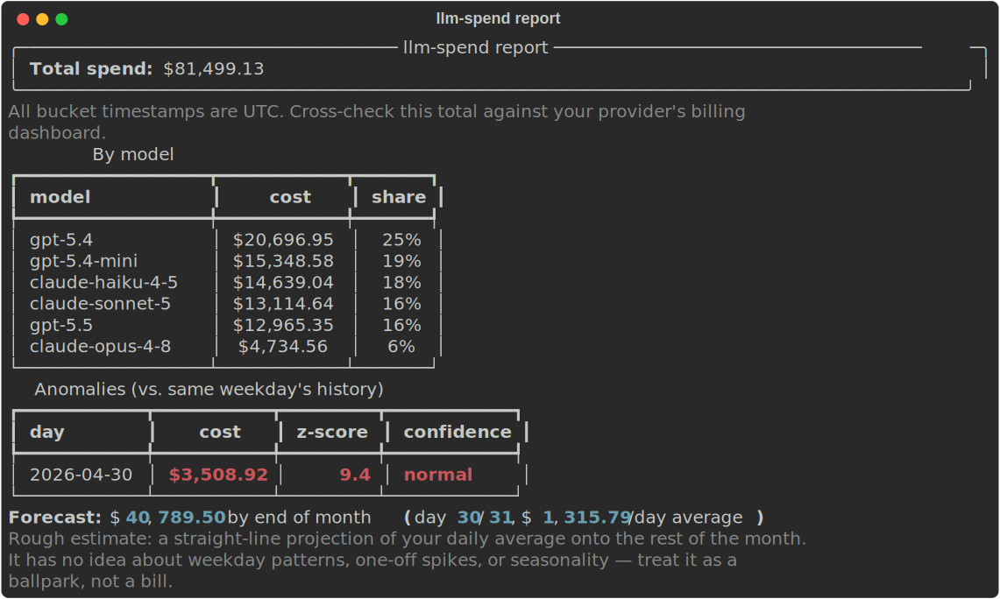

# llm-spend

Read-only CLI for LLM API spend: attribution, a rough end-of-month forecast,
and same-model what-if comparisons (batch gap, cache hit rate, service-tier
gap). Supports OpenAI and Anthropic.



*Report on synthetic demo data (team-scale profile). Run
`python scripts/synth_data.py` to reproduce — or
[see a full sample report](docs/demo-report.html).*

## Install

Requires Python 3.12+.

```
uv pip install -e .
```

## Quickstart

Three ways in, from zero commitment to full setup — pick whichever matches
how much you trust a brand-new CLI with your data right now.

### Path A — Try it in 60 seconds (no account needed)

Generate a synthetic dataset and render a report against it — no API key,
no CSV, no real data at all:

```
PYTHONPATH=src python scripts/synth_data.py --scale both --out synthetic/
mkdir -p .llm-spend-cache
cp synthetic/team.json .llm-spend-cache/openai.json
llm-spend report
```

This writes `synthetic/personal.json` (a ~$50/month solo-developer profile)
and `synthetic/team.json` (a ~$50K/month team profile), each with an
injected cost anomaly so the anomaly detector has something to find.

### Path B — Your real data, no API keys (recommended first step)

No admin key, no OAuth, nothing to grant — export a CSV from your
provider's own dashboard and import it directly:

1. **OpenAI:** Usage & billing dashboard (platform.openai.com, under your
   organization's **Usage** page) → export/download the usage or cost CSV
   for the date range you want.
2. **Anthropic:** Console (console.anthropic.com) → your organization's
   **Usage** page → export the usage/cost CSV for the date range you want.

   *(Exact menu labels shift as providers redesign their dashboards —
   if a step above doesn't match what you see, look for an
   "export"/"download CSV" control on the usage or billing page.)*

3. Reshape it into llm-spend's generic schema (not any provider's native
   export format) — required columns: `bucket_ts, provider, model,
   input_tokens, output_tokens, cost_usd`. Optional: `api_key_id, project,
   service_tier, batch_flag, cached_tokens`. A handful of rows is enough to
   try it; script the reshape once you're happy with the output.

```
llm-spend import --csv usage_export.csv
llm-spend report
```

### Path C — Full setup (admin API keys)

```
export OPENAI_ADMIN_KEY=...      # sk-admin-... — Admin API key with api.usage.read + api.costs.read scopes
export ANTHROPIC_ADMIN_KEY=...   # sk-ant-admin01-...

llm-spend pull --provider openai --since 2026-06-01
llm-spend pull --provider anthropic --since 2026-06-01
llm-spend report --format html -o report.html
```

Use a key scoped to read-only usage/cost access, not a general-purpose API
key — see **Security posture** below for exactly which scopes to grant.

### Sharing a report safely

`llm-spend report --share` renders an anonymized version: percentages and
ratios instead of dollar amounts, masked API key/project names ("key-1",
"project-1", ...). Model names stay visible since they're not private
identifiers. Sections with no safe percentage substitute for an absolute
dollar figure (total spend, forecast, overspend scenario, reconciliation)
are dropped entirely — meant to be safe to screenshot into Slack or a
public post.

```
llm-spend report --share
llm-spend report --share --format html -o report_share.html
```

## Security posture

- **Read-only, no proxy.** `llm-spend` never writes to a provider or routes
  any of your real API traffic through it — it only calls the admin
  usage/cost *reporting* endpoints.
- **Least-privilege keys.** Use an Admin API key scoped to read-only
  usage/cost access, not a general-purpose key. OpenAI: create one under
  **Settings → Organization → Admin keys**, not the project-scoped
  **Settings → API keys** page, and grant only the `api.usage.read` /
  `api.costs.read` scopes. Anthropic: create an Admin API key
  (`sk-ant-admin01-...`) under your organization settings.
- **Keys never touch disk.** They're read from `OPENAI_ADMIN_KEY` /
  `ANTHROPIC_ADMIN_KEY` environment variables only — never written to a
  config file or the local cache.
- **What's cached locally:** `.llm-spend-cache/` holds one JSON file per
  provider with the normalized usage/cost data `pull` retrieved — nothing
  else. Files are written `0600`, and the directory writes its own
  `.gitignore` the first time it's created.

## What leaves your machine: nothing

`llm-spend` makes exactly the read calls you configure (`pull` against a
provider's admin API, or nothing at all if you're on the CSV/synthetic
path) and writes exactly two kinds of file locally: the JSON cache under
`.llm-spend-cache/` and whatever report file you ask for with `-o`. No
telemetry, no analytics, no crash reporting, no external requests from the
report renderer — `render_html`'s output has no `<script>`, no external
stylesheet, no external image, nothing that phones home when you open it
in a browser or forward it to someone.

## Troubleshooting

- **OpenAI: "Admin API keys aren't available for this organization."**
  Admin API keys require your org to be on the **Team** plan, not
  **Individual** — if you signed up solo, convert first: platform.openai.com
  → **Settings → Organization → General** → **Convert to Team**. Once
  converted, create the Admin key under **Settings → Organization → Admin
  keys** (platform.openai.com/settings/organization/admin-keys) — a
  different page from the project-scoped **API keys** page.
- **Anthropic: where's the Admin API key?** console.anthropic.com → your
  organization's settings → **Admin keys** (a different page from regular
  workspace API keys) — the key starts with `sk-ant-admin01-`.
- **Where's the CSV export?** Both providers put it on the same page as
  the dashboard you'd check to eyeball spend: OpenAI's **Usage** page,
  Anthropic Console's **Usage** page — look for an export/download control
  there rather than under a separate "exports" or "reports" section.
  Dashboard layouts shift; if the exact labels above are stale by the time
  you're reading this, that's the general place to look.

## Feedback

Found a bug, or something's missing for your workflow?
[Open an issue](https://github.com/kliukovkin/llm-spend/issues).

## Status

v0.1, feature-complete for the initial scope described above.

- `pull --provider openai` and `pull --provider anthropic` work: usage+costs,
  pagination, rate-limit backoff, an independent reconciliation total.
  Verified against real OpenAI and Anthropic accounts.
- `import --csv` works: no admin key needed, llm-spend's own generic schema.
- `report` works against cached data (from either `pull` or `import`):
  attribution, forecast, same-model what-if (batch gap, tier gap, cache hit
  rate), overspend scenario, and same-weekday anomaly detection, in both
  terminal and HTML, plus an anonymized `--share` mode for safe screenshots.
